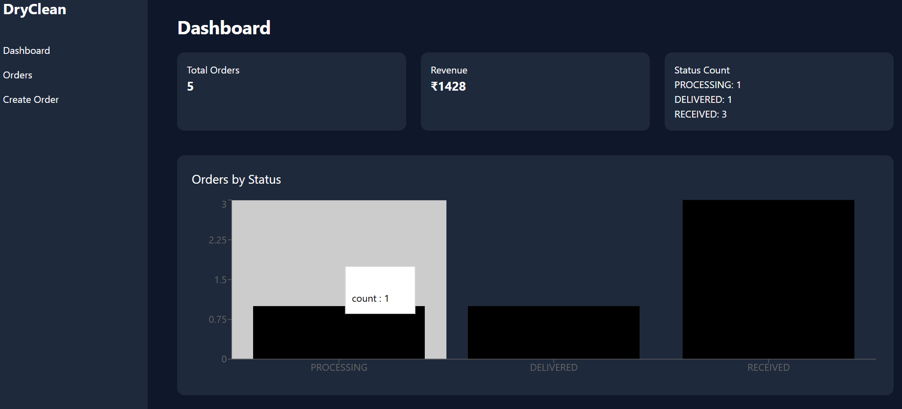
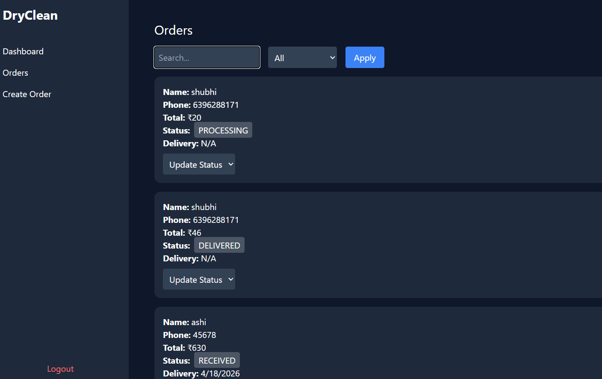

# 🧺 Dry Cleaning Order Management System

## 🚀 Overview

This project is a full-stack system to manage dry cleaning orders.
It allows creating orders, tracking status, calculating billing, and viewing analytics.

---

## ⚙️ Tech Stack

* Frontend: React + Tailwind CSS
* Backend: Flask (Python)
* Database: MySQL
* AI Tool: ChatGPT

---

## 🧩 Features

### Core Features

* Create orders with garments
* Calculate total bill
* Order status tracking (RECEIVED → DELIVERED)
* Update order status
* View all orders
* Filter by status, name, phone

---

### Bonus Features

* React frontend UI
* Login system
* MySQL database
* Search functionality
* Delivery date estimation
* Dashboard with analytics
* Charts using Recharts

---

## 📸 Screenshots

### Login Page


### Dashboard



### Orders



---

## 🔧 Setup Instructions

### Backend

```
cd backend
pip install flask flask-cors mysql-connector-python
python app.py
```

### Frontend

```
cd my-app
npm install
npm run dev
```

---

## 🧠 AI Usage

### Tools Used

* ChatGPT

### How AI Helped

* Generated backend APIs
* Built React components
* Fixed bugs and errors
* Improved UI

### Issues with AI

* Incorrect code placement
* SQL errors
* Debugging required

---

## ⚖️ Tradeoffs

* Basic authentication (no JWT)
* Minimal validation
* Simple UI

---

## 🚀 Future Improvements

* JWT authentication
* Payment integration
* Better UI/UX
* Deployment

---

## 👨‍💻 Author

Shubhi Jain
